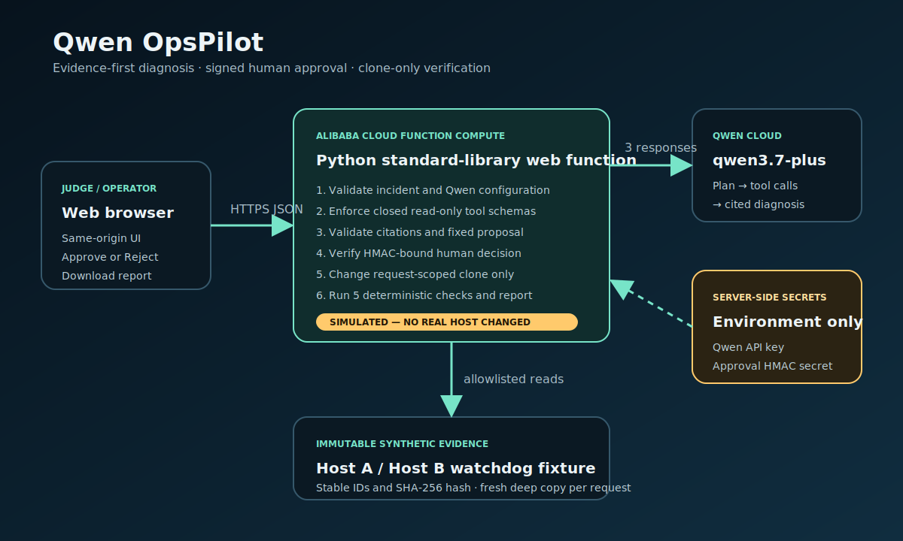

# Qwen OpsPilot

Qwen OpsPilot is a safe Autopilot Agent for a recurring Windows operations problem: one scheduled watchdog flashes a PowerShell window on the signed-in desktop while an equivalent watchdog stays invisible on another host.

The app gives Qwen an ambiguous symptom, lets it produce an investigation plan, executes only four schema-validated read-only fixture tools, and requires evidence citations before it can identify the decisive `InteractiveToken` versus `S4U` session difference. A human can then approve or reject one signed **simulated** remediation. The approved path changes only a request-scoped clone, runs five deterministic checks, and downloads an audit report. It never changes a real host.

## Why Track 4: Autopilot Agent

- Starts from an ambiguous operational symptom.
- Uses live `qwen3.7-plus` planning and diagnosis.
- Invokes external read-only tools through a closed schema boundary.
- Shows a visible `BLOCKED_BY_POLICY` denial for unsafe requests.
- Requires a short-lived, integrity-bound human approval or rejection.
- Verifies the simulated outcome with deterministic code and leaves an audit handoff.

## Architecture



The browser talks only to the same-origin Python service. The service owns the Qwen API key, HMAC secret, allowlisted tool schemas, immutable fixture, and report validation. No secret is returned to the browser or included in the report.

## Demo flow

1. Load the anonymous Host A / Host B incident.
2. Run the live Qwen investigation and inspect provider, model, run ID, plan, four allowed tool calls, evidence, and cited diagnosis.
3. Show the deliberate policy denial.
4. Review the exact simulated `InteractiveToken` to `S4U` proposal, prerequisites, limitations, rollback, hashes, and expiry.
5. Approve the simulated change and confirm all five checks pass.
6. Download the Markdown audit report.

## Run locally

Requirements: Python 3.10+ and a Qwen Cloud API key.

PowerShell:

```powershell
$env:DASHSCOPE_API_KEY = '<your-qwen-cloud-key>'
$env:DASHSCOPE_BASE_URL = 'https://dashscope-intl.aliyuncs.com/compatible-mode/v1'
$env:QWEN_MODEL = 'qwen3.7-plus'
python app.py
```

Open `http://127.0.0.1:9000/`.

The local process generates an ephemeral HMAC key. To keep approval/report capabilities valid across multiple server instances, set a private value of at least 32 characters:

```powershell
$env:OPSPILOT_HMAC_SECRET = '<strong-random-server-only-value>'
```

Never commit either secret.

## Test

The project uses only the Python standard library and native browser APIs.

```powershell
python -m unittest -v
python -m py_compile app.py test_app.py
node --check static/app.js
```

Without Qwen credentials, the deterministic offline suite passes and the single live smoke is skipped. With credentials present, the live smoke must also pass and proves that Qwen generated the plan and diagnosis.

## Deploy to Alibaba Cloud Function Compute

Create a **Web Function** using **Custom Runtime / Python**. Upload a ZIP whose root contains `app.py`, `fixtures/`, and `static/`.

Use these runtime settings:

- Startup command: `python3 app.py`
- Listener port: `9000`
- Internet access: enabled, so the function can call Qwen Cloud
- Public HTTP trigger: enabled for the judgeable demo URL

Set these server-side environment variables in Function Compute:

| Name | Value |
|---|---|
| `DASHSCOPE_API_KEY` | Your private Qwen Cloud key |
| `DASHSCOPE_BASE_URL` | `https://dashscope-intl.aliyuncs.com/compatible-mode/v1` |
| `QWEN_MODEL` | `qwen3.7-plus` |
| `OPSPILOT_HMAC_SECRET` | A new random value of at least 32 characters |
| `OPSPILOT_BIND_HOST` | `0.0.0.0` |

Function Compute supplies the configured custom listener port through `FC_CUSTOM_LISTEN_PORT`; the app also accepts `PORT` as a fallback. Check `/api/health` after deployment, then run the complete browser demo.

## Safety model

- All evidence is a synthetic, immutable JSON fixture.
- Tool names and `{host: A|B}` arguments are validated in application code.
- Qwen cannot choose filesystem paths, URLs, commands, or mutation operations.
- Approval HMAC binds the run, fixture version/hash, canonical run hash, proposal hash, and expiry.
- Valid approval changes exactly three fields on a fresh deep copy.
- Report generation revalidates a separate signed decision and excludes both tokens.
- Dynamic browser output uses `textContent`; report values are indented JSON, not interpreted markup.

## Limitations

- The MVP supports one incident playbook and no persistent run history.
- Remediation is intentionally simulated; there is no live Windows collector or Scheduled Task mutation API.
- The in-process concurrency guard is suitable for this single-function demo, not a distributed production control plane.

## License

[MIT](LICENSE)
